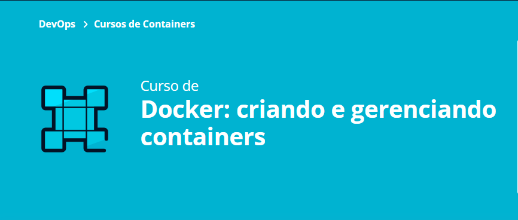

<h1 align="center">Docker</h1>

Curso de Docker da escola Alura.

  

 

Conteudo abordados no curso:

- Suba um container Docker
- Crie e personalize imagens
- Compreenda os conceitos de persistência através de volumes
- Utilize redes para comunicar seus containers
- Coordene seus containers com o Docker Compose

